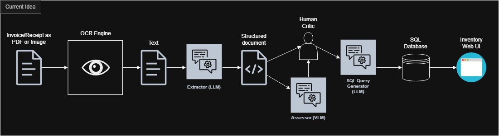
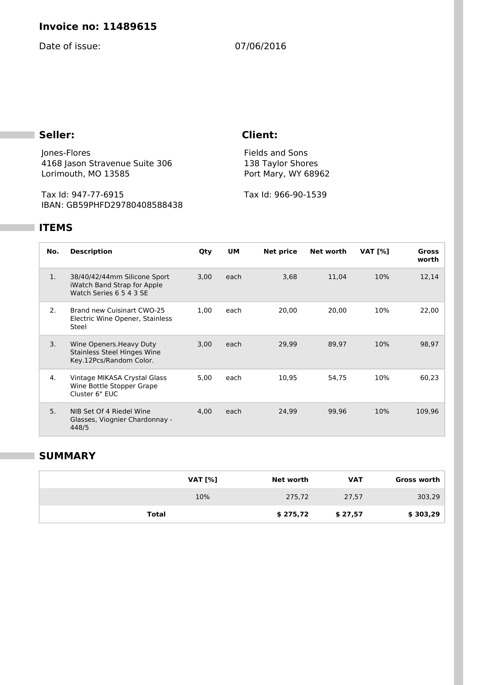

# Invoice Information Extractor

## Description

### Motivation

<!-- What is the real-world problem being tackled? -->

In a real world scenario, businesses handle a lot of invoice documents that are to be processed and information to be extracted from them. Some businesses might already have an automatic document process pipeline that is triggered right when an order is placed and stores all information in a database. On the other hand, if documents are not automatically handled, this project aims to handle invoices by scanning these documents with the help of state-of-the-art Optical Character Recognition (OCR) regardless of document structure but it should still be a categorized as an invoice.

### Pre-trained model/method

<!-- What pre-trained AI/ML models or algorithms are planned to be used and improved. The project can focus on issues other than accuracy (e.g., time, memory, parallelization etc.) -->
To get an understanding of what models might be of most use to us, we found [this survey](https://ieeexplore.ieee.org/document/11193825) by Khan et al., published on October 6th, 2025, which details the prominence of various machine learning methods for the task of text extraction. According to its findings, Visual Transformers (ViT) and Generative Adversarial Networks (GAN) are the most prominent architectures today, with ViTs being better for multilingual documents and GANs being better when the quality of the image is poor. Given that our current datasets mostly consist of clear images and PDFs, with a few different languages present, we draw the conclusion that focusing on ViTs is most appropriate. 

According to our estimations, multi-modal VLMs with a maximum of 6B billion parameters or less would be suited for our application in order to run it on our local machine. If the accuracy becomes too poor or we find that the capabilities of the model is too limited, we will look at models with a larger amount of parameters and try to run it on an A-100 GPU.

Given the above findings, we will initially experiment with [**Qwen3-VL-2B**](https://huggingface.co/docs/transformers/model_doc/qwen3_vl), which is a multi-modal vision-language model that is good for visual understanding and processing of text information. Our plan is to fine-tune this model for the tasks outlined below.

#### Planned program flow:

### Dataset

<!-- What dataset is planned to be used, and how to collect data for the project -->

The datasets that will be used are various invoice datasets gathered from sources such as _Huggingface_ or _Kaggle_. The dataset include **images of invoices** (currently +2000 images) together with the **truth text data** within the images in json format.

**Dataset from hugginface:**
- https://huggingface.co/datasets/katanaml-org/invoices-donut-data-v1
- https://huggingface.co/datasets/doceoSoftware/docvqa_invoices_v1
- https://huggingface.co/datasets/Aoschu/German_invoices_dataset
- https://huggingface.co/datasets/michalaerson/annotated-energy-invoices
- https://huggingface.co/datasets/ilhamxx/xdata_invoices
- https://huggingface.co/datasets/featsystems/invoices
---
**Example invoices from datasets:**
 
 

### Team members:

-   Aron Kesete (AronKG)
-   Isac Gustafsson (Aaetpio)
-   Martin Nilsson (MarrisSparrisNilsson)
