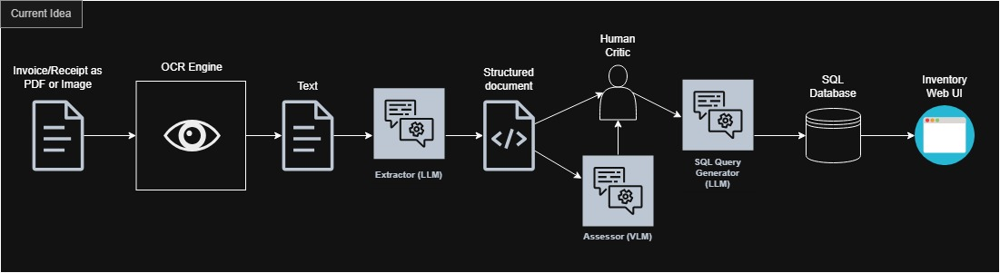
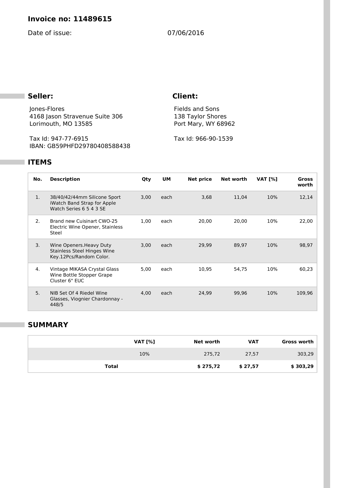
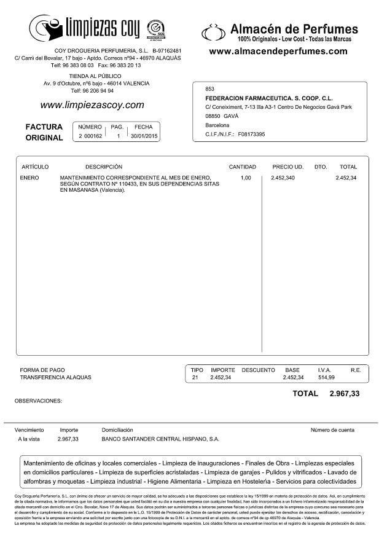
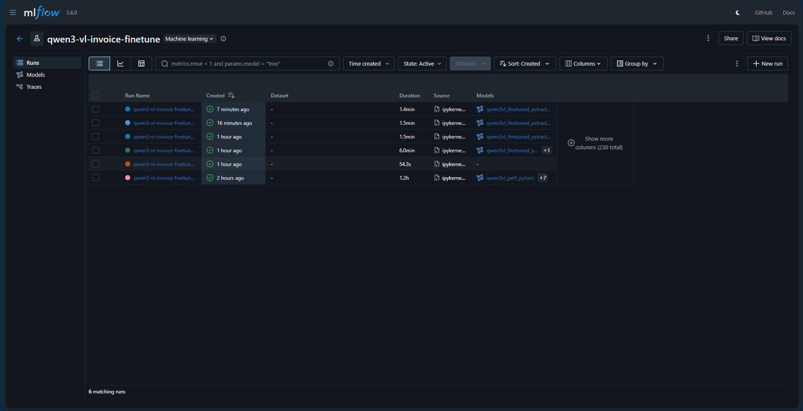
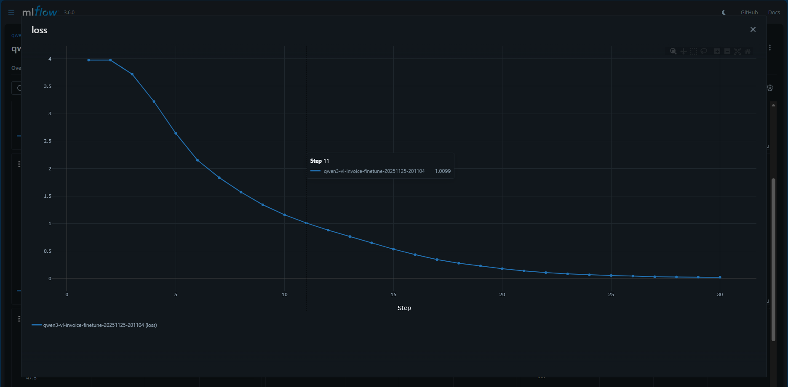
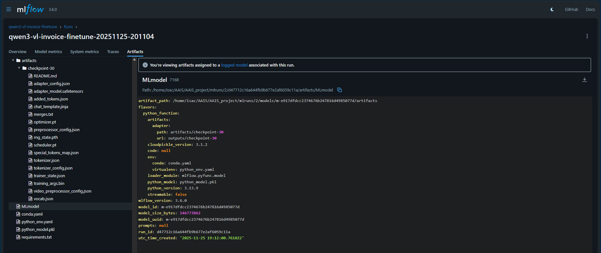

# Invoice Information Extractor

### Team members:

|      Name       |    GitHub Handle     |
| :-------------: | :------------------: |
|   Aron Kesete   |        AronKG        |
| Isac Gustafsson |       Aaetpio        |
| Martin Nilsson  | MarrisSparrisNilsson |

## Description

### Motivation

<!-- What is the real-world problem being tackled? -->

In a real world scenario, businesses handle a lot of invoice documents that are to be processed and information to be extracted from them. Some businesses might already have an automatic document process pipeline that is triggered right when an order is placed and stores all information in a database. On the other hand, if documents are not automatically handled, this project aims to handle invoices by scanning these documents with the help of state-of-the-art Optical Character Recognition (OCR), extracting relevant information (such as invoice number, products purchased, total cost) and generating appropriate database queries based on the extracted information.

### Pre-trained model/method

<!-- What pre-trained AI/ML models or algorithms are planned to be used and improved. The project can focus on issues other than accuracy (e.g., time, memory, parallelization etc.) -->

To get an understanding of what models might be of most use to us, we found [this survey](https://ieeexplore.ieee.org/document/11193825) by Khan et al., published on October 6th, 2025, which details the prominence of various machine learning methods for the task of text extraction. According to its findings, Visual Transformers (ViT) and Generative Adversarial Networks (GAN) are the most prominent architectures today, with ViTs being better for multilingual documents and GANs being better when the quality of the image is poor. Given that our current datasets mostly consist of clear images and PDFs, with a few different languages present, we draw the conclusion that focusing on ViTs is most appropriate.

According to our estimations, multi-modal VLMs with a maximum of 6B billion parameters or less would be suited for our application in order to run it on our local machine. If the accuracy becomes too poor or we find that the capabilities of the model is too limited, we will look at models with a larger amount of parameters and try to run it on an A-100 GPU.

Given the above findings, we will initially experiment with [**Qwen3-VL-2B**](https://huggingface.co/docs/transformers/model_doc/qwen3_vl), which is a multi-modal vision-language model that is good for visual understanding and processing of text information. Our plan is to fine-tune this model for the tasks outlined below.

#### Planned program flow:



1. **Input:** User provides an invoice as an image or PDF.
2. **OCR:** The invoice is passed to an OCR Engine (most likely implemented via a ViT) which solely converts the text on the image into a text file.
3. **Extraction:** The generated text file is passed to an agent fine-tuned to extract particular pieces of information, such as _invoice number_, _products purchased_, _total cost_, and outputs this in a structured JSON document.
4. **Control:** The structured JSON document is passed, along with the original invoice, to both a VLM and a human critic (the user) for comparison. The purpose of the VLM is to act as a second critic, who passes its conclusion (along with the confidence of said conclusion) to the human critic. The human critic will be shown the original invoice and the generated JSON document (most likely presented in a more readable format than pure JSON) side-by-side, along with the VLMs assessment and confidence. The human critic can either approve or reject; if approved, the system continues to step 5 and if rejected, the system could re-run steps 2-4 or abort the process, allowing the user to start over from the beginning.
5. **Query Generation & Execution:** The JSON document is passed to an agent fine-tuned to generate SQL queries to add or update the extracted information to the database, and these queries are autonomously executed through a Model Context Protocol (MCP) connection to the database.
6. **Visible Change:** The user can inspect the updated database directly through a web-based UI.

### Experiment and Dataset

<!-- What dataset is planned to be used, and how to collect data for the project -->

The primary datasets that will be used are various invoice datasets gathered from _Huggingface_. The datasets include **images of invoices** (currently +2000 images) together with the **truth text data** within the images in json format. We also intend to compose a small dataset, consisting of invoices recieved by the members of the team.

**Links to datasets:**

-   https://huggingface.co/datasets/katanaml-org/invoices-donut-data-v1
-   https://huggingface.co/datasets/doceoSoftware/docvqa_invoices_v1
-   https://huggingface.co/datasets/Aoschu/German_invoices_dataset
-   https://huggingface.co/datasets/michalaerson/annotated-energy-invoices
-   https://huggingface.co/datasets/ilhamxx/xdata_invoices
-   https://huggingface.co/datasets/featsystems/invoices

---

**Example invoices from datasets:**





---

**Experiment Details:**

Our first fine-tuning experiments consisted of tuning the OCR model to solely output the detected invoice number. These experiments are implemented in the `fine_tune_mlflow.ipynb` notebook along with the utilized hyperparameters, optimizers and metrics. To cut down on the training time, we only fine-tune about 1.1% of the model's 2 billion parameters. Below are a few screenshots from MLFlow:



This screenshot shows the runs performed using the latest model.



This screenshot shows the loss metric decreasing over the training steps as the model learns to adhere to the requested output, indicating that the fine-tuning process is successful.



This screenshot shows the artifacts produced by our latest run. Among the artifacts are the dependencies of the model (in terms of Python packages) and the checkpoint for the trained parts of the model at the final training step.

**Initial Experiment Insights**

From what we have seen, it would appear that the model which we selected can be fine-tuned to perform the tasks we require with relative ease. Further testing with larger subsets of the found datasets will be needed to truly assess how well the model can be fine-tuned, along with the implementation of some form of accuracy metric in order to check that the model outputs the correct information.

## Project Installation and Setup

If you are using **Conda environments**, run:

```bash
conda env create -f environment.yml
```

If you are using **virtual Python environments**:

> Run `install_dependencies.py` to install `requirements.txt` packages and `pytorch` installation.

Or do it manually by running:

```bash
py -m pip install -r requirements.txt
```

To run a initial test of the training and fine tuning with 3 images from the training set using Qwen3-VL model, follow the instructions inside the `fine_tune_mlflow.ipynb` notebook.

**Note:** Running the fine-tuning requires access to a **cuda GPU** with around 8-12 GB VRAM.

### Update `requirements.txt`

> Run the `update_requirements.py` to generate _top-level dependencies_ from your current `.venv`.

## Deployment

For upcoming deployment steps we will be using Docker with docker compose files to start up services, such as the `vlm-processor`, `database`, and `web-ui`.

**MLFlow** will be used to serve the latest pre-trained model to docker.

**FastAPI** will act as the hosting server which provides the API for our application that is well suited for production.

## Progressive Design Updates

We decided to change the used model to an alternative Qwen3-VL model named: [Qwen3-VL-2B-Instruct-unsloth-bnb-4bit](https://huggingface.co/unsloth/Qwen3-VL-2B-Instruct-unsloth-bnb-4bit). We noticed that the previous model took a long time to run locally and therefore sought out a more lightweight version. This one utilizes quantization, which essentially means that the precision of the data type is decreased to save memory and computation.
